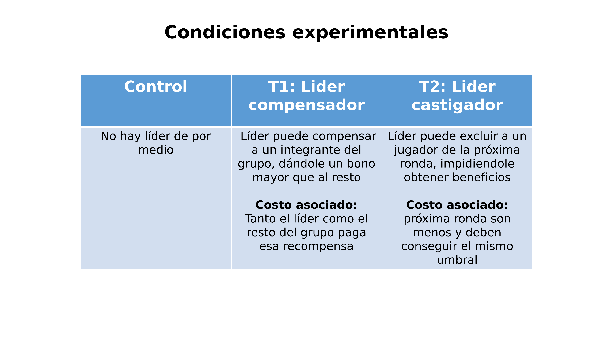
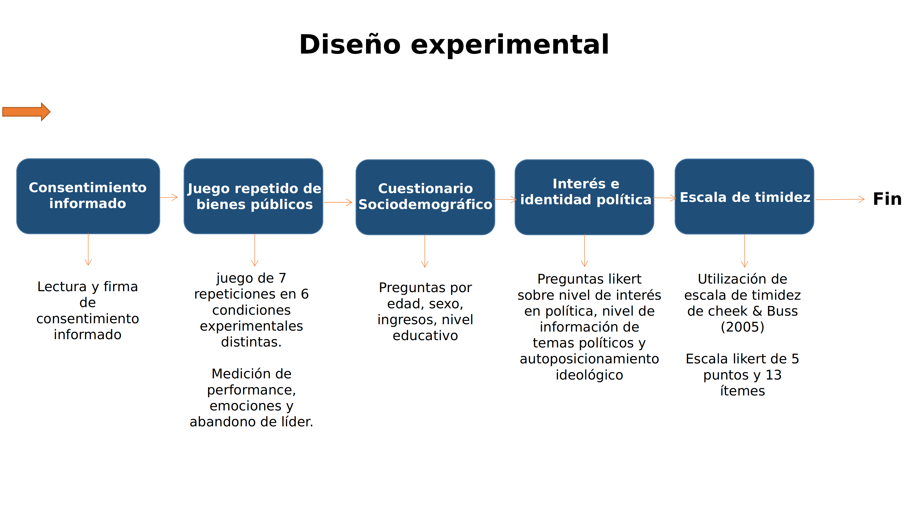
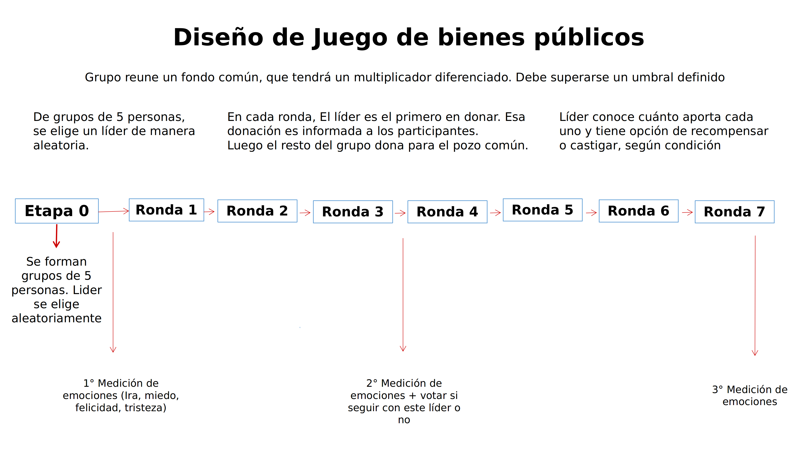

class:center, middle, bg_karl

```{r setup, include=FALSE}
options(htmltools.dir.version = FALSE)
knitr::opts_chunk$set(
  fig.width=9, fig.height=3.5, fig.retina=3,
  out.width = "100%",
  cache = FALSE,
  echo = TRUE,
  message = FALSE, 
  warning = FALSE,
  hiline = TRUE
)
```


```{r xaringan-themer, include=FALSE, warning=FALSE}
library(knitr)
library(xaringanthemer)
style_duo_accent(
  primary_color = "#b01333",
  secondary_color = "#085e9f",
  inverse_header_color = "#FFFFFF"
)
```
```{css, echo=F}
h1, h2, h3 {
  text-align: center;
}
```


```{css, echo = F}
.reduced_opacity {
  opacity: 0.1;
}
.bg_karl {
  position: relative;
  z-index: 1;
}
.bg_karl::before {    
      content: "";
      background-image: url('https://leverageedublog.s3.ap-south-1.amazonaws.com/blog/wp-content/uploads/2020/03/05191207/Political-Leaders.png');
      background-size: cover;
      position: absolute;
      top: 78px;
      right: 0px;
      bottom: 0px;
      left: 0px;
      opacity: 0.35;
      z-index: -1;
}
```

## Efectos de sistemas de liderazgo político en el comportamiento de los seguidores.


<br>
<br>
<br>
<br>

#### Francisco Villarroel-Riquelme (CICS- UDD) 


<br>
<br>
<br>
<br>

```{r, echo=FALSE, message = FALSE, out.width="20%", fig.align='center'}

```
---

```{r, echo=FALSE, message = FALSE, out.width="30%", fig.align='center'}

knitr::include_graphics("https://i.guim.co.uk/img/media/0a0b5ea6830b7900a34d83a82b18b1934287f7b5/0_161_4928_2959/master/4928.jpg?width=445&quality=45&auto=format&fit=max&dpr=2&s=68c234e76aa40e3eeafbc9009b57eaf1")

knitr::include_graphics("https://www.lavanguardia.com/files/image_948_465/uploads/2018/12/22/5fa452708916f.jpeg")

knitr::include_graphics("https://ca-times.brightspotcdn.com/dims4/default/5f3b678/2147483647/strip/true/crop/5718x3812+0+0/resize/1200x800!/format/webp/quality/80/?url=https%3A%2F%2Fcalifornia-times-brightspot.s3.amazonaws.com%2Fc2%2F41%2F124d34d2e11cae60520ceae916de%2Fd7b21100b3b1480589f515e4f1b1e1fd")

```
---
background-image: url(pitch_files/logo2017a.png)
background-size: 160px
background-position: 97% 97%
class: middle, bg_karl


```{css, echo=F}
h1, h2, h3 {
  text-align: center;
}
```


```{css, echo = F}
.reduced_opacity {
  opacity: 0.1;
}
.bg_karl {
  position: relative;
  z-index: 1;
}
.bg_karl::before {    
      content: "";
      background-image: url('https://leverageedublog.s3.ap-south-1.amazonaws.com/blog/wp-content/uploads/2020/03/05191207/Political-Leaders.png');
      background-size: cover;
      position: absolute;
      top: 0px;
      right: 0px;
      bottom: 0px;
      left: 0px;
      opacity: 0.15;
      z-index: -1;
}
```

### ¿Cómo es el comportamiento de los seguidores en distintos sistemas de liderazgo?

--

#### Usando la Teoría Evolucionista de Liderazgo (ELT) y la psicología política evolutiva, Queremos investigar el comportamiento de los seguidores en base a distintos sistemas de liderazgo (autoritarios e igualitarios) y según las condiciones de adversidad presentes en el entorno

---
background-image: url(pitch_files/logo2017a.png)
background-size: 170px
background-position: 97% 7%
class: left, middle

### Marco teórico

.pull-left[

#### ¿Qué es el sistema de liderazgo?

- Proceso de influencia social para conseguir metas compartidas
- Es bidireccional (seguidor-lider/lider-seguidor)
- Coordinación de soluciones para llegar a metas
- Recurso grupal para el desempeño colectivo

]


.pull-right[

#### Tipos de sistemas de liderazgo

 - **Igualitario:** Basados en la persuación hace los seguidores. Rasgos de lider son la confianza, persistencia, humildad y competencia. Todo el grupo toma decisiónes.


 - **Autoritario:** Son producto de la competición por bienes escasos. Controlan recursos grupales y los administran. Lo seguidores lo encuentran útil pero los evitan. Pueden dejar de seguirlos o ignorarlos como castigo. Sólo el líder o un grupo muy reducido toma decisiones.

]

---
## Estudio 1: Liderazgo compensatorio y castigador en juegos de coordinación 

**Analizar cómo los mecanismos de retroalimentación afectan el comportamiento de los seguidores**


.pull-left[


#### Nos enfocaremos en 

- **Performance grupal**: Cómo es el desempeño general del grupo para obtener recursos

- **Emociones**: Tipo y nivel de emociones de los seguidores hacia el líder (ira, miedo, felicidad y tristeza)

- **Tendencia al abandono de líder**: Cuándo los seguidores abandonan a su líder

]

--

.pull-right[ 

#### Métodos

- _lab-in-the-field_ experiment (N=300)

- Exposición de consentimiento informado 
- Juego de bienes comunes con umbral
- Preguntas de caracterización sociodemográfica
- Preguntas sobre consumo de información política, interés y autoidentificación política
- Escala de timidez


]

---
class: left, middle

```{r, echo=FALSE, out.width="100%", fig.align='center'}




```

---
background-image: url(pitch_files/logo2017a.png)
background-size: 170px
background-position: 97% 7%
class: left, middle

###¿Por qué con un juego de bienes públicos?

- Las distintas acciones colectivas requieren inversión de recursos (tiempo, dinero, habilidades, etc)
- Esta inversión de recursos puede tener resultados positivos o no (efecto del umbral)
- Los beneficios son para todo el grupo que realizó esa acción colectiva
- En ciertos contextos, estas se hacen varias veces (juego repetido) y en competencia con otros
- Dependiendo de los sistemas de liderazgo presentes, el líder puede desplegar estrategias hacia sus seguidores que pueden tener distintos efectos.

---
class: left, middle

### Características de las condiciones experimentales

```{r, echo=FALSE, out.width="100%", fig.align='center'}




```

---
class: left, middle


```{r, echo=FALSE, out.width="100%", fig.align='center'}




```

---
background-image: url(pitch_files/logo2017a.png)
background-size: 160px
background-position: 97% 97%
class: left, middle

## Hipótesis


1) Seguidores en sistemas de liderazgo con castigo tendrán mejor performance que sistemas basados en recompensa

2) Líderes basados en el castigo serán más abandonados que los basados en recompensa

3) En sistemas de liderazgo con castigo habrá una mayor intensidad que en sistemas basados en recompensa


---
background-image: url(pitch_files/logo2017a.png)
background-size: 170px
background-position: 98% 98%
class: left, top

## Proyecciones

--

#### 1) Complementar con literatura sobre economía del comportamiento

--

#### 2) Construir un _framing_ para el juego de bienes comunes (para aumentar realismo)

--

#### 4) Resolver dudas sobre muestra (cantidad de sujetos)


---
class: inversed, center, middle
background-image: url(https://user-images.githubusercontent.com/163582/45438104-ea200600-b67b-11e8-80fa-d9f2a99a03b0.png)
background-size: 80px
background-position: 50% 90%

# ¡Gracias!


###fvillarroelr@udd.cl

This slide was created by [**xaringan**](https://github.com/yihui/xaringan) package.


